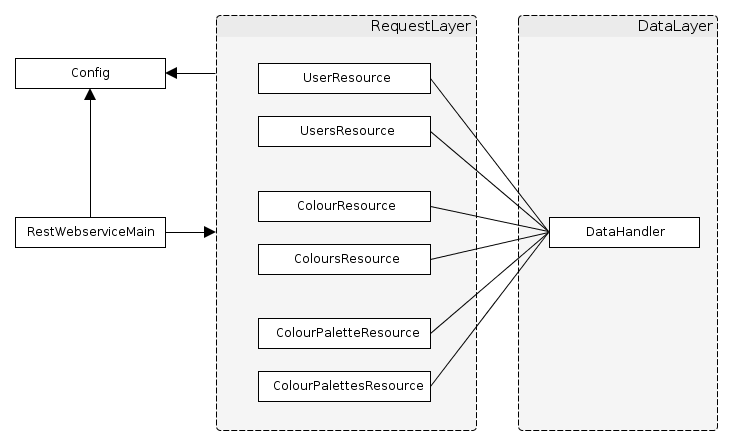

Fachhochschule Köln - Campus Gummersbach  
Web-basierte Anwendungen 2: Verteilte Systeme  

<a name="top"></a>

#Dokumentation 

1. [Idee](#idee)  
2. [Szenarien](#szenarien)  
    2.1. [Erstellung einer Farbe](#szenarien_farbe_erstellen)  
    2.2. [Farbe als Lieblingsfarbe festlegen](#szenarien_lieblingsfarbe_festlegen)  
    2.3. [Farbpalette erstellen](#szenarien_farbpalette_erstellen)  
    2.4. [Farbpalette als Lieblingspalette festlegen](#szenarien_lieblingsfarbpalette_festlegen)  
    2.5. [Farbe oder Farbpalette kommentieren](#szenarien_farbe_farbpalette_kommentieren)  
    2.6. [Lieblingsfarben eines Benutzers anzeigen](#szenarien_lieblingsfarben_eines_benutzers_anzeigen)  
    2.7. [Erzeugten Farbpaletten eines Benutzers anzeigen](#szenarien_erzeugten_farbpaletten_eines_benutzers_anzeigen)  
    2.8. [Anderen Benutzer abonnieren](#szenarien_anderen_benutzer_abonnieren)  
3. [URI- und Ressourcen-Design](#uri_ressourcen_design)  
    3.1. [Ressourcen](#uri_ressourcen_design_ressourcen)  
    3.2. [URI-Matrix](#uri_ressourcen_design_uri_matrix)  
4. [XML Schema](#xml_schema)  
    4.1. [Aufbau](#xml_schema_aufbau)  
5. [RESTful Webservice](#restful_webservice)  
    5.1. [Vorüberlegungen](#restful_webservice_vorueberlegungen)  
    5.2. [Aufbau](#restful_webservice_aufbau)  
    5.3. [Code-Ausschnitte](#restful_webservice_code_ausschnitte)  
    5.4. [Besonderheiten](#restful_webservice_besonderheiten)  
6. [XMPP-Server und Publish Subscribe](#xmpp_server_publish_subscribe)  
    6.1. [Eingesetzte Softwarepakete/APIs](#xmpp_server_publish_subscribe_eingesetzte_softwarepakete_apis)  
    6.2. [Publish-Subscribe](#xmpp_server_publish_subscribe_pubsub)  
        6.2.1 [XMPP](#xmpp_server_publish_subscribe_pubsub_xmpp)  
        6.2.2 [Leafs \(Topics\)](#xmpp_server_publish_subscribe_pubsub_leafs)  
        6.2.3 [Publisher und Subscriber](#xmpp_server_publish_subscribe_pubsub_publisher_subscriber)  
        6.2.4 [Eigenschaften einer Benachrichtigung](#xmpp_server_publish_subscribe_pubsub_eigenschaften_benachrichtigung)  
    6.3 [Java, Openfire und Smack\(x\)](#xmpp_server_publish_subscribe_java_openfire_smackx)  
7. [Benutzerauthentifizierung](#benutzerauthentifizierung)  

[Literatur](#literatur)  


***

##<a id="idee"></a>1. Idee
Für viele Designarbeiten kann es nötig sein, bestimmte Farbkombinationen und Farbpaletten zu erstellen, die miteinander harmonieren oder zusammen ein bestimmtes Gefühl hervorrufen.
Es gibt fast endlose Möglichkeiten unterschiedliche Farben anzuordnen.
Die Idee ist es nun Menschen die Möglichkeit zu geben, solche Farbkombinationen zu erstellen und mit anderen Farb-Enthusiasten zu teilen. Damit diese Farbkombinationen und Paletten von interessierten Menschen gefunden werden können, soll es für jeden einzelnen Möglich sein, Lieblingsfarben anzugeben.
Diese Lieblingsfarben werden dann herangezogen, um die Benutzer über neue Farbkombinationen, Farbpaletten und evtl. Farbmustern zu informieren, wenn eine oder mehrere dieser Lieblingsfarben für die Zusammenstellung verwendet wurden. Ein Benutzer wird somit immer über neue Kreationen, die ihn interessieren könnten, auf dem Laufenden gehalten.
Wenn einem Benutzer eine Farbpalette oder Muster mit seiner Lieblingsfarbe gefällt, kann dieser diese ebenfalls favorisieren bzw. als eine Lieblingspalette festlegen.
Zudem ist es einem Benutzer ebenfalls gestattet Kommentare zu einer bestimmten Farbe oder Farbpalette zu hinterlassen.
Um dem Projekt zusätzlich eine leichte Note eines sozialen Netzwerks zu verleihen, können Benutzer andere Benutzer folgen und dadurch ihre Erzeugnisse abonnieren.

<a class="right" href="#top">^ top</a>

##<a name="szenarien"></a>2. Szenarien

###<a name="szenarien_farbe_erstellen"></a>2.1 Erstellung einer Farbe
BenutzerIn A bemerkt, dass das die Platform noch über sehr wenige Farbeinträge verfügt. Er/Sie entscheidet sich einige Einträge für bekannte Farben zu erstellen.
Dazu gibt er/sie zu einer Farbe dessen Farbcode ein oder wählt sie über einen Farbwähler aus. Mit dem Absenden des Fabcodes wird auf der Platform ein eindeutiger Eintrag für diese Farbe erzeugt.
Der Eintrag wird mit dem Namen des Erzeugers verknüpft.

**Sequenz-Diagramm**


###<a name="szenarien_lieblingsfarbe_festlegen"></a>2.2 Farbe als Lieblingsfarbe festlegen
BenutzerIn A möchte gerne eine Farbe als eine Lieblingsfarbe angeben. Dazu gibt er/sie den Farbcode der Farbe an oder wählt sie über einen Farbwähler aus.
Da die Farbe noch nicht bekannt ist und nicht bekannte Farben nicht als Lieblingsfarbe gesetzt werden können, wird für sie vorher ein neuer eindeutiger Eintrag erzeugt und mit dem Namen des Erzeugers verknüpft.
Erst jetzt kann die Farbe als Lieblingsfarbe des/der Benutzers/in gesetzt werden.

**Sequenz-Diagramm**


###<a name="szenarien_farbpalette_erstellen"></a>2.3 Farbpalette erstellen
BenutzerIn B möchte eine neue Farbpalette erstellen und legt mindestens 3 Farben fest, da es die Mindestanzahl der Farben einer Farbpalette entspricht.
Für alle drei Farben wird der jeweilige Farbcode eingegeben oder über einen Farbwähler ausgewählt. Nach dem Zusammenstellen der Farbpalette, wird sie der Platform bekannt gemacht. Die Farbpalette wird mit dem Benutezrnamen des Erzeugers verknüpft und erhält eine eindeutige Identifizierungsnummer.
Wenn zu einer der verwendeten Farben noch kein Eintrag existiert, wird dieser automatisch erzeugt und mit dem Namen des Benutzers verknüpft.
Die Platform überprüft, gleichzeitig zum Erstellen der Farbpalette, ob eine der Farben die Lieblingsfarbe mehrerer BenutzerInnen ist und informiert diese über die soeben erzeugte Farbpalette, die deren Lieblingsfarbe verwendet.
In diesem Fall ergab die Überprüfung der verwendeten Faben, dass eine der Farben gleichzeitig die Lieblingsfarbe von BenutzerIn A ist. BenutzerIn A erhält eine Meldung bezüglich der neuen Farbpalette.

**Sequenz-Diagramm**


###<a name="szenarien_lieblingsfarbpalette_festlegen"></a>2.4 Farbpalette als Lieblingspalette festlegen
BenutzerIn A gefällt eine Farbpalette so sehr, dass er/sie zu seinen/ihren Favoriten bzw. Lieblingspaletten hinzufügt.

**Sequenz-Diagramm**


###<a name="szenarien_farbe_farbpalette_kommentieren"></a>2.5 Farbe oder Farbpalette kommentieren
BenutzerIn A ist von einer Farbpalette von BenutzerIn B so begeistert, dass er/sie ein Kommentar zu dieser verfasst und hinzufügt.

**Sequenz-Diagramm**


###<a name="szenarien_lieblingsfarben_eines_benutzers_anzeigen"></a>2.6 Lieblingsfarben eines Benutzers anzeigen
BenutzerIn B lässt sich alle Lieblingsfarben von BenutzerIn A anzeigen.

**Sequenz-Diagramm**


###<a name="szenarien_erzeugten_farbpaletten_eines_benutzers_anzeigen"></a>2.7. Erzeugten Farbpaletten eines Benutzers anzeigen
BenutzerIn A vermutet, dass BenutzerIn B neben einer ihrer Lieblingspaletten auch weitere schöne Farbpaletten erzeugt hat. Deshalb lässt sie sich alle von BenutzerIn B erzeugten Farbpaletten anzeigen.

**Sequenz-Diagramm**


###<a name="szenarien_anderen_benutzer_abonnieren"></a>2.8. Anderen Benutzer abonnieren
Benutzer A ist von den von BenutzerIn B erzeugeten Paletten so sehr begeistert, dass sie auch in Zukunft über Farbpaletten von BenutzerIn B benachrichtig werden will.
Deshalb abonniert sie alle Erzeugnisse von BenutzerIn B. 

**Sequenz-Diagramm**


<a href="#top">^ top</a>


##<a name="uri_ressourcen_design"></a>3. URI- und Ressourcen-Design


###<a name="uri_ressourcen_design_ressourcen"></a>3.1. Ressourcen
Zu aller erst ist es wichtig zu wissen, dass für Farbe-Ressourcen ihr direkter Farbcode (HTML-Farbcode) als ID verwendet werden. Die Idee dahinter ist die, dass dadurch die API besser zu verstehen und zu überblicken ist. Für sich ist ein Farbcode eindeutig und wird über mehrere Bereiche hinweg als Identifizierungsmerkmal für eine Farbe verwendet.
Für jede Farbpalette muss aber hingegen eine neue eindeutige ID vergeben werden, da sie nur umständlich anhand ihrere natürlichen Merkmale identifiziert werden kann.  
Anhand der zuvor erstellten Szenarien kann man schon einige grundlegende Ressourcen festlegen.
Darunter fallen die Ressourcen `user`, `colour` sowie `colourpalette`.
Basierend auf diesen drei Ressourcen bilden sich weitere abgewandelte Ressourcen aber auch untergeordnete Ressourcen.
Als abgewandelte Ressourcen werden die Listen gezählt. Über die Ressource `users` würde man zu einer Liste aller exitierenden Benutzer gelangen. Eine Listen-Ressource ist an dem angehangenen `s` zu erkennen.
Zu der `users`-Ressource würden sich somit noch die beiden weiteren Listen-Ressourcen `colours` und `colourpalettes` hinzugesellen.  
Da es ganz hilfreich sein kann sich alle von einem Benutzer erstellten Farbpaletten geben zu lassen, wird der Ressource `user` die Unterressource `creations` vergeben, die sich auf einen bestimmten Benutzer bezieht. Folgende URI bietet sich an `/user/<user_id>/creations`. Das `s` gibt wieder an, dass es sich um eine Listen-Ressource handelt.  
Um eine Farbe als Favorit zu setzen, würde es sich weniger anbieten dafür eine eigene First-Level-Ressource einzuführen. Es macht viel mehr Sinn das Setzen einer Lieblingsfarbe mit dem entsprechenden Benutzer zu verbinden bzw. die Verbindung zu belassen.
Hierzu wird der `user`-Ressource eine untergeordnete Ressource mit dem Namen `favouritecolour` bzw. `favouritecolour` gegeben.
Zum Hinzufügen oder Löschen einer Favorisierung, muss dennoch die ID der favorisierten Farbe oder der Farbpalette angegeben werden. Dies sieht dann wie folgt aus: `PUT /user/42/favouritecolour/333333` bzw. `PUT /user/42/favouritecolourpalette/20` oder `DELETE /user/42/favouritecolour/333333` bzw. `DELETE /user/42/favouritecolourpalette/20`.
Aber auch hier soll es möglich sein sich eine Liste von allen Lieblingsfarben und Lieblingsfarbpaletten eines Benutzers geben zu lassen. Somit würde `/user/<user_id>/favourite/colours` bzw. `/user/<user_id>/favourite/colourpalettes` eine Liste aller Lieblingsfarben bzw. -farbpaletten liefern.
Mit der Möglichkeit Kommentare zu einer Farbe oder einer Farbpalette zu verfassen, kann auch hier eine neue untergeordnete Ressource mit dem Namen "comment" eingeführt werden. Auch hier würde ein `/color/<colour_id>/comments` eine Liste aller zu der Farbe verfassten Kommentare zurückgegeben werden. Das selbe auch mit `/colourpalette/<colour_palette_id>/comments`.  
Zuletzt können Benutzer von anderen Benutzern gefolgt werden. Dazu wird die untergeordnete Ressource `follower` eingeführt, die sich auf den angegebenen Benutzer bezieht. `followers` wäre somit wieder eine Listen-Ressource, die alle Benutzer auflistet, die den besagten Benutzer folgen. `follower` erlaubt es jetzt Benutzer als Follower hinzufügen und auch wieder zu entfernen. Dazu muss die ID des Benutzers aber mit angegeben werden wie z.B. wie folgt: `PUT /user/42/follower/23` sowie `DELETE /user/42/follower/23`. 


<a href="#top">^ top</a>


###<a name="uri_ressourcen_design_uri_matrix"></a>3.1. URI-Matrix

|  | GET | PUT | POST | DELETE |
| :------- | :----------: | :--------------: | :---------------: | :-----------------: |
| /user | - | - | Benutzer erstellen | - |  
| /user/&lt;user&#95;id> | Benutzerinformationen zurückgeben | Benutzerangaben aktualisieren | - | Benutzer löschen |
| /user/&lt;user&#95;id>/creations | Liste aller Farbpaletten zurückgeben | - | - | - |  
| /user/&lt;user&#95;id>/follower/&lt;user&#95;id> | - | Benutzer als Follower hinzufügen | - | Benutzer als Follower entfernen |  
| /user/&lt;user&#95;id>/followers | Liste aller Follower zurückgeben | - | - | - |  
| /user/&lt;user&#95;id>/favouritecolour/&lt;colour&#95;id> | - | Farbe als Lieblingsfarbe setzen | - | Farbe als Lieblingsfarbe entfernen |  
| /user/&lt;user&#95;id>/favouritecolours | Liste aller Lieblingsfarben des Benutzers zurückgeben | - | - | - |  
| /user/&lt;user&#95;id>/favouritecolourpalette/&lt;colourpalette_id> | - | Farbpalette als Lieblingsfarbpalette setzen | - | Farbpalette als Lieblingsfarbpalette entfernen |  
| /user/&lt;user&#95;id>/favouritecolourpalettes | Liste aller Lieblingsfarbpaletten zurückgeben | - | - | - |  
| /users | Liste aller Benutzer zurückgeben | - | - | - |  
|  | **GET** | **PUT** | **POST** | **DELETE** |  
| /colour | - | - | Farbe erstellen | - |  
| /colour/&lt;colour&#95;id> | Angaben über die Farbe zurückgeben | - | - | - |  
| /colour/&lt;colour&#95;id>/comment | - | - | Kommentar erstellen | - |  
| /colour/&lt;colour&#95;id>/comment/&lt;comment&#95;id> | - | - | - | Kommentar löschen |  
| /colour/&lt;colour&#95;id>/comments | Liste aller Kommentare zu einer Farbe zurückgeben | - | - | - |  
| /colours | Liste aller Farben zurückgeben | - | - | - |  
|  | **GET** | **PUT** | **POST** | **DELETE** |  
| /colourpalette | - | - | Farbpalette erstellen | - |  
| /colourpalette/&lt;colourpalette&#95;id> | Informationen über die Farbpalette zurückgeben | - | - | - |  
| /colourpalette/&lt;colourpalette&#95;id>/comment | - | - | Kommentar erstellen | - |  
| /colourpalette/&lt;colourpalette&#95;id>/comment/&lt;comment&#95;id> | - | - | - | Kommentar löschen |  
| /colourpalette/&lt;colourpalette&#95;id>/comments | Liste aller Kommentare zu einer Farbpalette zurückgeben | - | - | - |  
| /colourpalettes | Liste aller Farbpaletten zurückgeben | - | - | - |   


<a href="#top">^ top</a>


##<a name="xml_schema"></a>4. XML Schema

Neben dem URI- und Ressourcen Design, muss auch das XML Schema, auf welches im Projekt sehr stark gesetzt wird, wohlüberlegt konzipiert werden.
Deshalb bietet es sich an das Schema Schritt für Schritt eine solide Basis zu definieren, auf die die restliche Struktur aufsetzt. Konkret sieht das so aus, dass die im Unterpunkt 3.1 identifizierten grundlegenden Ressourcen `user`, `colour` sowie `colourpalette` als zuvor erwähnte Basis herangezogen werden.
Sie bilden die grundlegenden Ressourcen, aus denen sich Variationen bilden. Speziell sei das Beispiel `colour` und `favourite_colour` genannt. `favourite_colour` ist an sich ebenfalls eine Ressource, die eine Ableitung von `colour` darstellt. Der einzige Unterschied besteht nur in der zusätzlichen Angabe des Zeitpunkts wann eine Farbe als Lieblingsfarbe gesetzt wurde.
Hier kann man sich leicht der Objektorientierung bedienen, speziell der Vererbung. Dies bietet sich auch sehr gut an, da ein XML Schema einem ähnliche Möglichkeiten zur Strukturierung bzw. Aufbau bietet. Hier sei auf die Möglichkeiten der Erweiterung (`extension`) und der Restriktion (`restriction`) von komplexen Typen hingewiesen. In diesem Fall setzt man aber konkret nur auf die Möglichkeit der Erweiterung, um Typen gezielt zu spezialisieren.
Neben Spezialisierungen von Typen bzw. Elementen, wird auch das Zusammenfassen von solchen Elementen zu Mengen betrachtet. Damit ist gemeint, dass ein übergeodnetes Element existiert, welches als Container fungiert. Dies kann man ganz gut mittels der Ressource `users` verdeutlichen. Die Ressource repräsentiert eine Liste die aus mehreren User-Ressourcen (`user`) besteht. Dadurch, dass es über die REST-Schnittstelle möglich ist eine Liste aller Benutzer anzufordern, bietet es sich auch an auf Seiten von XML ein Listen- bzw. Container-Element einzuführen.
Listen gibt es nicht nur für Benutzer (`users`), sondern auch zur Auflistung von Farben (`colours`), Lieblingsfarben (`favourite_colours`), Lieblingsfarbpaletten (`favourite_colourpalettes`) aber auch von Benutzern die einen bestimmten Benutzer folgen, sognannte Follower (`followers`).  
Eine Besonderheit des XML Schemas ist es, dass es Dokumente mit unterschiedlichen Wurzelelementen erfolgreich validiert. Im Gegensatz zur Phase 1, wo das konzipierte Schema nur ein Wurzelelement vorsah, ist dieses Schema der Phase 2 sehr viel flexibler gestaltet. In Phase 1 wurden die Daten so modelliert, dass eine Dokumenteninstanz wirklich alle aufgekommenen Daten enthielt. Für den Anwendungsfall ist dies sicherlich die beste herangehensweise, doch für Phase 2 nicht mehr. Hier sollten nur Daten zwischen einem Clienten und einem Server transportiert werden, die entsprechend des Kontexts relevant sind.
Mit Kontext ist hiermit die Semantik der HTTP-Operationen gemeint. Es ist somit weniger sinnvoll wenn ein Request wie z.B. `GET /user/1` einem Clienten neben den Informationen zum Benutzer mit der ID 1, auch alle anderen Informationen bzw. Daten des Systems liefert, die nichts mit der klar identifizierten Ressource zu tun hat. Es würde völlig ausreichen nur den relevanten Teil der kompletten Datenstruktur zurückzugeben. Dafür muss das Schema mit den Anwendungsfällen im Hinterkopf entsprechend ausgearbeitet werden.  
Generell ist das Schema dieses Projekts sehr modular aufgebaut und stützt sich verstärkt auf Referenzierung von Elementen. Die Idee der Referenzierung hat sich auch in die Struktur einer Dokumenteninstanz ausgebreitet. Als Beispiel soll die Ressource `colour` angeführt werden. Ein Request wie z.B. `GET /color/333333` würde sämtliche Informationen über die Farbe mit dem Farbcode `333333` liefern. Darunter fallen der Zeitpunkt wann die Ressource im System erstellt wurde, aber auch von welchem Benutzer. Anstatt sich bei einem Request neben den Farbinformationen auch alle Infromationen des Benutzers liefern zu lassen,
würde es völlig ausreichen, wenn der Benutzer nur über eine ID referenziert wird. Interessiert sich ein Client dann noch näher für den Benutzer, dann würde ein zusätzlicher Request initiiert werden, um die Benutzer-Ressource anhand der ID anzusprechen. Der Vorteil dabei ist, dass nicht unnötig Daten übertragen werden, die evtl. garnicht benötigt werden. Der Nachteil könnte in den zusätzlichen Requests gesehen werden, die das Liefern der relevanten Daten, je nach Gegebenheit des Netzes, spürbar verzögert. Es wurde sich aber bewusst für die Referenzierung bzw. "Verlinkung" von Ressourcen untereinander entschieden,
da dessen Vorteile für sich sprechen. Kleinere Datenmengen führen zu schnelleren und effizienteren Datenübertragungen. Zusätzlich erhält der Client nur die für die Operation relevanten Daten und muss sie nicht vorher in einer wohlmöglich sehr großen Datenstruktur finden und aus ihr dann noch extrahieren.  
Neben der Möglichkeit einzelne Element-Fragmente erfolgreich zu validieren, wurde das Schema um die Möglichkeit erweitert, eine größere zusammenhängende XML-Struktur zu validieren. Mit großer XML-Struktur ist eine Struktur gemeint, die alle relevanten Daten des Systems auf einmal führen kann. Die Möglichkeit der Bildung einer solchen allumfassenden Struktur, ist für die komplette Datenaufnahme wichtig. Somit gibt es auf sietens des Servers eine einzige XML-Dokumenten-Instanz, die alle Daten enthält. Es müssen somit nicht unnötig viele kleine XML-Dokumente mit Datenfragementen auf dem Data Layer organisiert werden.
Es können Vergleiche zwischen der großen XML-Dokumenten-Instanz und einer Datenbank bzw. Datenbankdatei (sqlite) gezogen werden.  
Das Hinzufügen von Daten ist so gesehen die einfachste Operation, die man implementieren kann. Schwieriger wird es dann aber, wenn es um das Löschen von Daten bzw. Datensätzen geht. Speziell Datensätze, die an einer anderern Stelle referenziert werden. Es stellt sich nun die Frage, wie mit solchen Elementen umgegangen werden soll, die nicht mehr auf ein existierendes Element referenzieren, geschweige sie als erstes zu suchen und auch zu finden. In der momentanen Form bietet es sich nur an die komplette Struktur zu traversieren und wirklich alle Elemente auf eventuelle Referenzen zu prüfen und sie ggf. zu löschen.

###<a name="xml_schema_aufbau"></a>4.1 Aufbau

```xml
<?xml version="1.0" encoding="UTF-8"?>
<xsd:schema xmlns:xsd="http://www.w3.org/2001/XMLSchema"
            xmlns:xsi="http://www.w3.org/2001/XMLSchema-instance">
    <xsd:annotation>
        <xsd:documentation xml:lang="DE">
            ColourConnection
            Jorge H. F. Pereira
            FH-Köln - Campsus GM / Web-basierte Anwendungen 2 / 2013
        </xsd:documentation>
    </xsd:annotation>
```  

Hier wurden Angaben über das Schema gemacht, um es später besser zuordnen zu können.

    
```xml
    <xsd:complexType name="Ref">
        <xsd:attribute name="id" type="xsd:positiveInteger" />
        <xsd:attribute name="ref" type="xsd:string" />
    </xsd:complexType>
```  

Durch die Besonderheit, dass Elemente bzw. Datensätze in vielen Fällen nur referenziert werden, anstatt die kompletten Informationen zu übertragen, wurde der Complex Type `Ref` eingeführt.
Dieser wird aber nur für die Referenzierung von Elementen verwendet, die auf eine fortlaufende nummerische ID setzen.
Das Element setzt sich aus einem ID-Attribut und einem Attribut für die Ressourcen-Teil-URI vom Typ `/colourpalette/1` zusammen.
Dieser Complextype wird überwiegend nur dafür verwendet Benutzer und Farbpaletten zu referenzieren.
Für Colour-Elemente wird wegen der Besonderheit der gewählten ID-Form, weiter unten ein eigener Referenzierungs-Type eingeführt.


```xml
    <xsd:simpleType name="ColourID">
        <xsd:restriction base="xsd:string">
            <xsd:pattern value="[0-9a-fA-F]{6}" />
        </xsd:restriction>
    </xsd:simpleType>
    
    <xsd:complexType name="Colour">
        <xsd:sequence>
            <xsd:element name="creator" type="Ref" minOccurs="1" maxOccurs="1" />
            <xsd:element name="date_of_creation" type="xsd:dateTime" minOccurs="1" maxOccurs="1" />
        </xsd:sequence>
        <xsd:attribute name="id" type="ColourID" />
    </xsd:complexType>
    
    <xsd:complexType name="ColourRef">
        <xsd:attribute name="id" type="ColourID" />
        <xsd:attribute name="ref" type="xsd:string" />
    </xsd:complexType>
```  

Diese drei Types wurden einschließlich für die Kapselung, Identifizierung und Referenzierung von Farbdaten eingeführt.
Durch die Besonderheit, dass eine Farbe über seinen HTML-Farbcode eindeutig identifiziert werden kann, wurde sich dafür entschieden diesen Farbcode auch als ID zu verwenden.
Um sicherzustellen, dass auch wirklich ein gültiger Farbcode verwendet wird, wird dieser immer über einen entsprechenden Regulären Ausdruck geprüft. Dabei sind nur Zeichen von `0` bis `9` und von `a` bis `f`, samt den entsprechenden Großbuchstaben erlaubt, wie es aus der hexadezimalen Schreibweise von Zahlen bekannt ist.
Zudem setzt sich ein Farbcode insgesamt aus sechs solcher Zeichen zusammen. Die ersten Zwei Zeichen geben den Rotanteil, die mittleren Zwei den Grünanteil und die letzten beiden den Blauanteil an.  
Für eine Farbe ist nur die ID, der Ersteller und das Datum wann die Farbe im System aufgenommen wurde relevant.  
Zuletzt wird noch der bereits weiter oben erwähnte Referenzierungs-Type für eine Farbe eingeführt. Wie zu sehen ist, wird als ID-Type der Simple Type "ColourID" verwendet, anstelle des Standard Type "positiveInteger".

```xml
    <xsd:complexType name="User">
        <xsd:sequence>
            <xsd:element name="username" type="xsd:string" minOccurs="1" maxOccurs="1" />
            <xsd:element name="date_of_registration" type="xsd:dateTime" minOccurs="1" maxOccurs="1" />
        </xsd:sequence>
        <xsd:attribute name="id" type="xsd:positiveInteger" />
    </xsd:complexType>
```  

Für den User wird ebenfalls ein Element eingeführt, um für die Erstellung einer Benutzer-Ressource alle relevanten Informationen über einen neuen User mitzureichen, aber auch die Daten eines Benutzer bei einem GET-Request gekapselt ausliefern zu können.
Dabei ist für einen User nur seine ID, sein Benutzername und das Datum seiner Registrierung relevant.

```xml
    <xsd:complexType name="ColourPalette">
        <xsd:sequence>
            <xsd:element name="creator" type="Ref" minOccurs="1" maxOccurs="1" />
            <xsd:element name="date_of_creation" type="xsd:dateTime" minOccurs="1" maxOccurs="1" />
            <xsd:element name="used_colours" minOccurs="1">
                <xsd:complexType>
                    <xsd:sequence>
                        <xsd:element name="colour" type="ColourRef" minOccurs="2" maxOccurs="10"/>
                    </xsd:sequence>
                </xsd:complexType>
            </xsd:element>
        </xsd:sequence>
        <xsd:attribute name="id" type="xsd:positiveInteger" />
    </xsd:complexType>
```  

Eine Farbpalette setzt sich zum einen aus einem Elementen welches den Ersteller referenziert (wie an dem verwendeten Elementen Type `Ref` zu sehen), dem Datum bzw. Zeitpunkt wann die Palette erstellt wurde und einer Sequenz an Elementen, die die verwendeten Farben referenzieren.
Es wurde sich dafür entschieden, dass sich eine Farbpalette minimal aus 2 und maximal aus 10 Farben zusammensetzen kann.

```xml
    <xsd:complexType name="FavouriteColour">
        <xsd:complexContent>
            <xsd:extension base="ColourRef">
                <xsd:sequence>
                    <xsd:element name="favourite_since" type="xsd:dateTime" minOccurs="1"
                                                                            maxOccurs="1" />
                </xsd:sequence>
            </xsd:extension>
        </xsd:complexContent>
    </xsd:complexType>
    
    <xsd:complexType name="FavouriteColourPalette">
        <xsd:complexContent>
            <xsd:extension base="Ref">
                <xsd:sequence>
                    <xsd:element name="favourite_since" type="xsd:dateTime" minOccurs="1"
                                                                            maxOccurs="1" />
                </xsd:sequence>
            </xsd:extension>
        </xsd:complexContent>
    </xsd:complexType>
```  

Dadurch, dass ein Benutzer eine Farbe oder eine Farbpalette favorisieren kann, wurden zwei weitere Complex Types eingeführt, um diesen Zustand der Favorisierung festzuhalten bzw. zu verdeutlichen.
Auch hier wird über ein Unterelement auf die entsprechende Ressource referenziert, anstatt die komplette Informationen zu einer Ressource einzubetten.
Hinzu kommt noch die Angabe über den Zeitpunkt, wann die entsprechende Farbe oder Farbpalette favorisiert wurde.

```xml
    <xsd:complexType name="UserList">
        <xsd:sequence>
            <xsd:element name="user" type="Ref" minOccurs="0" maxOccurs="unbounded" />
        </xsd:sequence>
    </xsd:complexType>
    
    <xsd:complexType name="ColourList">
        <xsd:sequence>
            <xsd:element name="colour" type="ColourRef" minOccurs="0" maxOccurs="unbounded">
            </xsd:element>
        </xsd:sequence>
    </xsd:complexType>
    
    <xsd:complexType name="ColourPaletteList">
        <xsd:sequence>
            <xsd:element name="colourpalette" type="Ref" minOccurs="0" maxOccurs="unbounded" />
        </xsd:sequence>
    </xsd:complexType>
 
    <xsd:complexType name="FavouriteColourList">
        <xsd:sequence>
            <xsd:element name="favourite_colour"
                         type="FavouriteColour" minOccurs="0" maxOccurs="unbounded" />
        </xsd:sequence>
    </xsd:complexType>
    
    <xsd:complexType name="FavouriteColourPaletteList">
        <xsd:sequence>
            <xsd:element name="favourite_colourpalette"
                         type="FavouriteColourPalette" minOccurs="0" maxOccurs="unbounded" />
        </xsd:sequence>
    </xsd:complexType>
```  

Um mehrere Elemente als eine Art Liste zurückgeben zu können, wurden ebenfalls Complex Types definiert, die die Aufagbe eines Container-Elements einnehmen.
Auch hier werden zu einem Element nicht seine kompletten Daten mitgeschickt, sondern nur seine Referenz.

```xml
    <xsd:complexType name="Follower">
        <xsd:complexContent>
            <xsd:extension base="Ref">
                <xsd:all>
                    <xsd:element name="following_since" type="xsd:dateTime" minOccurs="1" />
                </xsd:all>
            </xsd:extension>
        </xsd:complexContent>
    </xsd:complexType>
    
    <xsd:complexType name="Followers">
        <xsd:sequence>
            <xsd:element name="follower" type="Follower" minOccurs="0" maxOccurs="unbounded"/>
        </xsd:sequence>
    </xsd:complexType>
```  

Durch die einem Benutzer gegebene Möglichkeit einen anderen Benutzer zu folgen, wurden ebenfalls für dieses Szenario Complex Types definiert, die es ermöglichen diese Informationen zwischen Clienten und Server auszutauschen.

```xml
    <xsd:complexType name="Comment">
        <xsd:sequence>
            <xsd:element name="creator" type="Ref" minOccurs="1" maxOccurs="1" />
            <xsd:element name="date_of_creation" type="xsd:dateTime" maxOccurs="1"/>
            <xsd:element name="message" type="xsd:string" minOccurs="1" maxOccurs="1" />
        </xsd:sequence>
        <xsd:attribute name="id" type="xsd:positiveInteger" />
    </xsd:complexType>
    
    <xsd:complexType name="Comments">
        <xsd:sequence>
            <xsd:element name="comment" type="Comment" minOccurs="0" maxOccurs="unbounded"/>
        </xsd:sequence>
    </xsd:complexType>
```  

Zu jeder Farbe oder einer Farbpalette kann ein Benutzer einen oder mehrere Kommentare verfassen.
Auch hierfür gibt es zwei Complex Types, die sich um die Kapselung der Daten kümmern.
Für Kommentare wurde ebenfalls ein eigener Container Type eingeführt, um eine Liste von Kommentaren zu ermöglichen.

```xml
    <xsd:complexType name="ColourConnection">
        <xsd:sequence>
            <xsd:element name="users" minOccurs="1" maxOccurs="1">
                <xsd:complexType>
                    <xsd:sequence>
                        <xsd:element name="user" minOccurs="0" maxOccurs="unbounded">
                            <xsd:complexType>
                                <xsd:complexContent>
                                    <xsd:extension base="User">
                                        <xsd:sequence>
                                            <xsd:element ref="favourite_colours"
                                                         minOccurs="1"
                                                         maxOccurs="1"/>
                                            <xsd:element ref="favourite_colourpalettes"
                                                         minOccurs="1"
                                                         maxOccurs="1"/>
                                            <xsd:element ref="followers" minOccurs="1" maxOccurs="1" />
                                            <xsd:element name="creations"
                                                         type="ColourPaletteList"
                                                         minOccurs="1"
                                                         maxOccurs="1" />
                                        </xsd:sequence>
                                    </xsd:extension>
                                </xsd:complexContent>
                            </xsd:complexType>
                        </xsd:element>
                    </xsd:sequence>
                </xsd:complexType>
            </xsd:element>
            <xsd:element name="colours" minOccurs="1" maxOccurs="1">
                <xsd:complexType>
                    <xsd:sequence>
                        <xsd:element name="colour" minOccurs="0" maxOccurs="unbounded">
                            <xsd:complexType>
                                <xsd:complexContent>
                                    <xsd:extension base="Colour">
                                        <xsd:sequence>
                                            <xsd:element name="comments" minOccurs="1" maxOccurs="1">
                                                <xsd:complexType>
                                                    <xsd:sequence>
                                                        <xsd:element ref="comment"
                                                                     minOccurs="0"
                                                                     maxOccurs="unbounded" />
                                                    </xsd:sequence>
                                                </xsd:complexType>
                                            </xsd:element>
                                        </xsd:sequence>
                                    </xsd:extension>
                                </xsd:complexContent>
                            </xsd:complexType>
                        </xsd:element>
                    </xsd:sequence>
                </xsd:complexType>
            </xsd:element>
            <xsd:element name="colourpalettes" minOccurs="1" maxOccurs="1">
                <xsd:complexType>
                    <xsd:sequence>
                        <xsd:element name="colourpalette" minOccurs="0" maxOccurs="unbounded">
                            <xsd:complexType>
                                <xsd:complexContent>
                                    <xsd:extension base="ColourPalette">
                                        <xsd:sequence>
                                            <xsd:element name="comments" minOccurs="1" maxOccurs="1">
                                                <xsd:complexType>
                                                    <xsd:sequence>
                                                        <xsd:element ref="comment"
                                                                     minOccurs="0"
                                                                     maxOccurs="unbounded" />
                                                    </xsd:sequence>
                                                </xsd:complexType>
                                            </xsd:element>
                                        </xsd:sequence>
                                    </xsd:extension>
                                </xsd:complexContent>
                            </xsd:complexType>
                        </xsd:element>
                    </xsd:sequence>
                </xsd:complexType>
            </xsd:element>
        </xsd:sequence>
    </xsd:complexType>
```  

Um auf der Seite des Servers, alle Datensätze zu führen und verwalten zu können, definiert das Schema auch ein Complex Type, welcher ausschließlich für diese Aufgabe gedacht ist und nicht für die Kapselung von Daten zur Vorbereitung zu einer Datenübertragung.
Die Idee ist die, dass ein XML-Dokument existiert, wo alle dem System bekannten Datensätze eingepflegt, entnommen oder bearbeitet werden.  
Es wurde soweit es ging versucht existierende Complex Types und Elemente wiederzuverwenden, um das Schema klein zu halten. In einigen Fällen ist dies auch sehr gut gelungen, wie man im Bereich der Kommentar-Elemente sehen kann.
In anderen Fällen mussten aber neue Complex Types eingeführt werden, um eine Verbindung zwischen Datensätzen herzustellen bzw. einen Datensatz einem übergeordneten Datensatz zuordnen zu können. Speziell bezogen auf den User war es sehr oft nötig von ihm erstellte Farbpaletten, Lieblingsfarben sowie Lieblingsfarbpaletten ihm zuordnen zu können.  
Diese Herangehensweise hat aber auch seinen Nachteil. Im Hintergrund müssen Datensätze sehr oft umgebettet werden, damit diese entweder in die große Datenstruktur eingepflegt oder aus ihr entnommen werden können um ggf. einem Clienten die angeforderte Ressource in der vereinbarten Form zu liefern.

```xml
    <xsd:element name="user" type="User" />
    <xsd:element name="colour" type="Colour" />
    <xsd:element name="colourpalette" type="ColourPalette" />
    <xsd:element name="favourite_colour" type="FavouriteColour" />
    <xsd:element name="favourite_colourpalette" type="FavouriteColourPalette" />
    
    <xsd:element name="users" type="UserList" />
    <xsd:element name="colours" type="ColourList" />
    <xsd:element name="colourpalettes" type="ColourPaletteList" />
    <xsd:element name="favourite_colours" type="FavouriteColourList" />
    <xsd:element name="favourite_colourpalettes" type="FavouriteColourPaletteList" />
    
    <xsd:element name="followers" type="Followers" />
    <xsd:element name="comment" type="Comment"/>
    <xsd:element name="comments" type="Comments" />

    <xsd:element name="colour_connection" type="ColourConnection" />    
    
</xsd:schema>
```  

Zuletzt werden noch die Elemente mit ihren Complex Types definiert, die innerhalb einer XML-Instanz gültige Root-Elemente darstellen.
Dadurch, dass einzelne Grundelemente Root-Elemente sein können, wird erreicht, dass nur wirklich relevante Daten innerhalb eines dieser Elemente gekapselt übertragen werden.  
Dies ist sinnvoll, da somit die grundlegende Idee einer Ressource gestärkt wird. Das Verlangen einer Ressource sollte einzig und allein dazu führen, dass auch nur die Daten der identifizierten Ressource zurückgegeben werden.


<a href="#top">^ top</a>


##<a name="restful_webservice"></a>5. RESTful Webservice  
Schon in Punkt 3 wird auf das Thema `Resource` leicht eingegangen. Konkret in die Erstellung, dem Löschen und dem Zurückgeben einer Resource, oder allgemein der Verwaltung dieser.  
Der RESTful Webservice soll nun über die zuvor in Punkt 4 ausgearbeiteten HTTP-Operationen den Zugriff auf dieser Resourcen ermöglichen. Das bedeutet, dass die HTTP-Operationen in konkreten Code überführt, oder besser gesagt, Handler erzeugt werden müssen, die eingehende Requests im Sinne von z.B. "GET /user/1" erkennen und die damit symbolisierte Operation auf den Bestand der Resourcen ausführt.  
Für die Umsetzung des RESTful Webservice wird auf Jersey als Referenzimplementation von JAX-RS (Java API for Restful Web Services) und Grizzly als HTTP-Server gesetzt. Jersey ermöglicht auf der Seite des Servers die Abbildung eines Requests (abhängig von dem HTTP-Verb, URI und akzeptierten MIME-Types) auf Java-eigene Klassen bzw. Methoden. Vor allem das Abgreifen von Path- und Query-Parametern gestaltet die Umsetzung des Webservice einfacher.
Im Falle von Path-Parametern werden zu einer Resource relevante eindeutige Identifizierungsinformationen (evtl. eine ID) im Pfad eingebettet (`localhost/user/1`, wobei 1 die Identifizierungsinformation darstellt). Query-Parameter werden hingegen im Bereich des Query-Strings mitgereicht, wobei hier die Reihenfolge der Parameter keine Rolle spielt, da der mitgereichte Wert über einen zusätzlichen Schlüssel identifiziert wird (`...?key=value`).  
Doch zu aller erst werden mit dem Programm `xcj` aus dem entwickelten XML-Schema die nötigen Java-Klassen generiert, um sie zum marshallen und unmarshallen der übertragenden Daten zu nutzen. Jersey und JAXB werden somit zusammen eingesetzt, zumal sie beide sehr gut miteinander arbeiten.

<a href="#top">^ top</a>


###<a name="restful_webservice_vorueberlegungen"></a>5.1. Vorüberlegungen  
Vor der Umsetzung des Webservice, sollte überlegt werden, wie die Prozesse auf seitens des Servers ablaufen sollen. Zudem ist es sinnvoll eine klare Trennung der Vorgänge zu gewährleisten, um den Code im Nachhinein besser und einfacher warten zu können oder komplett zu ersetzen. Hier sollten die Vorteile einer einheitlichen Schnittstelle hervorgehoben werden.  
Für diese Phase ist es vorgesehen, dass die ganzen dem System bekannten Daten innerhalb von XML-Dokument-Instanzen, bzw. einer einzigen Instanz, gelagert werden. Angenommen es wird sich irgendwann später dafür entschieden die Datensätze in entsprechende externe Datenbanken zu verlagern, kann durch den evtl. modular aufgebauten Code und der einheitlichen Schnitttstelle gewährleistet werden, dass die Anpassung des Codes sich nur auf den Bereich des Datahandlings beschränkt. Die Logik bezüglich des Requesthandlings bleibt somit unangetastet.  
Man hat hier schon einen Schritt in Richtung klarer Trennung unterschiedlicher Vorgänge gemacht. Diese Trennung wurde leicht von Punkt 2 (Szenarien) mitgenommen. Wie in den dortigen Sequenz-Diagrammen zu sehen, herrschte schon bei der Entwicklung der Szenarien eine klare logische Trennung der Vorgänge. Es ergaben sich Rollen. Zum einen der Client der sich außerhalb des Servers befindet, der Request-Handler welcher sich um die Annahme von Request bzw. der Beatnwortung dieser kümmert und dem eigentlichen Data-Handling, wo die Daten, in diesem Fall, in eine exitierende XML-Struktur einpflegt bzw. aus dieser Daten entnimmt.
Der grobe Aufbau sieht wie folgt aus:  


**Client**  <--->  **Request-Handler**  <--->  **Data-Handler**
  

Jede Rolle kommuniziert nur mit einer seiner Nachbar-Rollen. Das bedeutet, dass z.B. der Client keine direkte Kommunikation mit dem Data-Handler führen kann, sondern den Weg über den Request-Handler gehen muss und erst dieser mit dem Data-Handler kommuniziert bzw. der Rolle/Instanz eine Nachricht schickt.  

Eine weitere wichtige Überlegung betrifft die Statuscodes. Nach jedem Request muss mit einem entsprechenden Repsonse geantwortet werden. Je nach Erfolg oder Misserfolg der Operation, muss ein entsprechender HTTP-Statuscode zurückgegeben werden.
Nach Betrachtung der HTTP-Operationen, wurde sich für die folgenden Statuscodes entschieden:  


| Statuscode | Bedeutung | Einsatz |
| :---: | :---: | :--- |
| **200** | OK | Rückgabe einer Ressource bzw. von Daten (Benutzer-, Farb-, Farbpaletteninformationen usw.) |  
| **201** | Created | Die Erstellung einer Ressource war erfolgreich und der Ort der neuen Resource wird im Header mitgegeben |  
| **204** | No Content | Ressource wird aktualisiert oder gelöscht; keine nennenswerten Daten als Rückgabe |  
| **404** | Not Found | Resource nicht gefunden; Sammelcode für wenn ein HTTP-Operation nicht erfolgreich war |  
  

<a href="#top">^ top</a>


###<a name="restful_webservice_aufbau"></a>5.2. Aufbau  

  

Das Diagramm zeigt die im src-Baum existierenden Klassen (JAXB-Klassen nicht betrachtet, da sie generiert werden).  
Der Haupteinstieg befindet sich in der Klasse `RestWebserviceMain`. Hier wird der HTTP-Server Grizzly gestartet und Jersey initialisiert. Der Pfeil in Richtung `RequestLayer` deutet an, dass die Ressourcen-Klassen von Jersey (Name des Packages, wo Jersy nach entsprechenden Klassen suchen soll, wird als Initialisierungsparameter mitgereicht) gefunden und für das "Matchen" der Request-URIs eingebunden werden.  
Die `RequestLayer`-Gruppe enthält alle von Jersey gefundenen Klassen, die sich um die Abwicklung der Requests kümmern. In diesen werden die gesendeten Daten abgefangen und dem DataHandler weitergereicht. Sie entscheiden auch darüber was für ein Response auf ein Request an ein Client zurückgesandt wird. Wichtig ist hierbei der Statuscode (200, 201, 404, etc.), der auf der Clientseite als Fehlercode verwendet werden soll, um auf bestimmte Fehler entsprechend reagieren zu können.  
Die Klasse `DataHandler` kümmert sich um das marshallen bzw. unmarshallen aller XML-Dokumente, aber auch um das Einbetten von neuen Datensätzen bzw. Löschen dieser in der datentragenden XML-Struktur, die alle vom System bekannten Daten führt. Wird ein bestimmter Datensatz von einer Klasse aus der `RequestLayer`-Gruppe angefordert, kümmert sich die `DataHandler` darum diesen speziellen Datensatz aus der XML-Struktur zu extrahieren und in eine Struktur umzubetten, die für die Übertragung der Daten vorgesehen ist.
Das Besondere an der `DataHandler`-Klasse ist, dass es von ihr nur eine einzige Instanz zu jedem Zeitpunkt geben kann. Hier sei das das Stichwort `Singleton-Pattern` gennant. Der Vorteil hierbei ist der, dass sich nicht mehrere unnötige Instanzen der Klasse im Speicher befinden, da alle Objekte so oder so immer auf den selben Datenbestand zugreifen würden. Somit wären mehrere Instanzen unnötig.  
Zuletzt gibt es noch die Klasse `Config`, die nur statische Attribute besitzt. In ihr sind Daten wie der `Hostname` un die verwendete `Portnummer` angegeben. Diese Daten sind für das Aufbauen eines URI-Strings, aber auch für die Initialisierung des Grizzly-Servers nötig. Deshalb auch die beiden Verbindungen aus beiden Richtungen hin zur `Config`-Klasse.

<a href="#top">^ top</a>


###<a name="restful_webservice_code_ausschnitte"></a>5.4. Code-Ausschnitte  

Die Methode `deleteUserFollower` aus ***src/de/fhkoeln/gm/wba2/phase2/rest_webservice/resources/UserResource.java***
```java
/**
 * Let a user unfollow a certain user
 * 
 * @param user_id id of the user being followed
 * @param follower_id id of the user following
 * @return HTTP-Response
 */
@DELETE
@Path("/{user_id}/follower/{follower_id}")
public Response deleteUserFollower(@PathParam("user_id") String user_id,
                                   @PathParam("follower_id") String follower_id) {
	
	boolean success = dh.deleteUserFollower(user_id, follower_id);
	
	if(success)
		return Response.noContent().build();
	else {
		return Response.status(404).build();
	}
}
```  

Diese Methode wird aufgerufen, wenn ein Request des Formats `DELETE /user/1/follower/2` gesendet wird.
Als Path-Parameter werden die beiden IDs der Benutzer mitgegeben. Die erste ID ist die ID des gefolgten Benutzers und die zweite ID ist die ID des Benutzers welcher folgt.  
Über die Methode `deleteUserFollower` werden dem DataHandler beide IDs als Parameter mitgereicht. Wurde die Ressource erfolgreich gelöscht, gibt die Methode ein `true` zurück, ansonsten ein `false`.
Je nach Wert wird ein entsprechendes Response-Objekt mit entsprechendem Statuscode "gebaut", welcher dann zurückgegeben wird. 
  
  

Die Methode `deleteUserFollower` aus ***src/de/fhkoeln/gm/wba2/phase2/rest_webservice/DataHandler.java***
```java
/**
 * Delete the entry representing a follwoing user
 * 
 * @param user_id id of the user being followed
 * @param follower_id id of the user following
 * @return success or failure
 */
public boolean deleteUserFollower(String user_id, String follower_id) {
	
	BigInteger bi_user_id = BigInteger.valueOf(Long.parseLong(user_id));
	BigInteger bi_follower_id = BigInteger.valueOf(Long.parseLong(follower_id));

	if(getFollowerObj(bi_user_id, bi_follower_id) != null) {
		
		ColourConnection.Users.User user_followed = getUserObj(bi_user_id);
		
		for(Follower curr_follower: user_followed.getFollowers().getFollower()) {
			if(curr_follower.getId().equals(bi_follower_id)) {
				user_followed.getFollowers().getFollower().remove(curr_follower);
				marshall_cc();
				return true;
			}
		}
	}
	
	return false;
}
```

Diese Methode, die über die gleichnamige Methode `deleteUserFollower` der Klasse `UserResource` aufgerufen wird, kümmert sich zum einen darum den Eintrag zu finden,
der die Verbindung zwischen den beiden Benutzern verdeutlicht und zum anderen auch darum diesen Eintrag dann zu löschen, sofern er ihn findet.
Wurde der Eintrag erfolgreich gelöscht, wird der Inhalt der XML-Struktur mit dem gesamten Datenbestand marshalled. Somit enthält die XML-Dokumenten-Instanz ("Datenbankdatei") ebenfalls den momentan aktuellen Stand.
Zuletzt wird `true` zurückgegeben, um der aufrufenden Methode mittzuteilen, dass das Löschen erfolgreich war. War es nicht erfolgreich, wird dementsprechend `false` zurückgegeben.

<a href="#top">^ top</a>


###<a name="restful_webservice_besonderheiten"></a>5.4. Besonderheiten  

Die Methode `getUsers` ist die einzige Methode mit der es möglich ist, anhand eines `QueryParam`, die Elemente der zurückgelieferten Liste zu filtern. Relevant wird dies, wenn man überprüfen will,
ob ein User mit einem bestimmten Namen existiert. Dazu wird der URI der Query-Parameter `username` mit dem entsprechendne Benutzernamen aufgebaut. Als Beispiel `GET /users?username=Horst`.
Wird kein Query-Parameter angegeben, dann weiß die Methode, dass die Einträge nicht gefiltert werden soll und liefert eine Liste aller dem System bekannten Benutzer.


```java
/**
 * Return a list of all existing users
 * 
 * @return HTTP-Response
 */
@GET
public Response getUsers(@DefaultValue("") @QueryParam("username") String username) {
    
    if(username.length() == 0)
        username = null;
    
    String users_str = dh.getUsers(username);
    
    return Response.ok().entity(users_str).type(MediaType.APPLICATION_XML).build();
        
}
```

<a href="#top">^ top</a>


##<a name="xmpp_server_publish_subscribe"></a>6. XMPP-Server und Publish Subscribe

<a href="#top">^ top</a>


###<a name="xmpp_server_publish_subscribe_eingesetzte_softwarepakete_apis"></a>6.1 Eingesetzte Softwarepakete/APIs
* Als XMPP-Server wird Openfire in der Version 3.8.1 eingesetzt
* Für den Zugriff auf den XMPP-Server kommt die Smack(x)-API in der Version 3.3 zum Einsatz

<a href="#top">^ top</a>


###<a name="xmpp_server_publish_subscribe_pubsub"></a>6.2 Publish-Subscribe
Publish-Subscribe ist ein Pattern, welches es ermöglicht Nachrichten zwischen mehreren Entitäten auszutauschen, ohne eine direkte Verbindung zwischen diesen aufbauen zu müssen.
Auf der einen Seite gibt es es den Abonnierer (Subscriber), der bestimmte `Topics` / Themen abonniert, für die er Interesse hegt. Auf der anderen Seite gibt dann noch den Veröffentlicher (Publisher), der Nachrichten zu einem bestimmten `Topic` / Thema veröffentlicht.
Zwischen beiden existiert nun ein Vermittler (Message Broker; auch Event Dispatcher genannt) \[[1](#ref_1)\], welcher die Nachricht an die Empfänger/Abonnierer des betroffenen `Topics` weiterleitet.  


<a href="#top">^ top</a>

####<a name="xmpp_server_publish_subscribe_pubsub_xmpp"></a>6.2.1 XMPP
Das XMPP (`Extensible Messaging and Presence Protocol`) ist ein Internetstandard der in den RFCs `6120-22` sowie `3922` und `3923` beschrieben ist. Es ermöglicht die Übertragung von XML-Daten in Echtzeit, womit auch der Haupteinsatz des Dienstes ermöglicht wird, nämlich das Versenden von Nachrichten zwischen am System (dezentral aufgebaut) angemeldeten Benutzern.
Neben der in den RFCs beschriebenen Hauptkomponenten des XMPPs, existieren auch Protokollerweiterungen, die unter der Bezeichnung `XEP` (XMPP Extension Protocols) gelistet werden. Darunter fallen Erweiterungen wie `Last Activity` ([XEP-0012](http://xmpp.org/extensions/xep-0012.html); beschreibt wie über XMPP eine "Zuletzt aktiv"-Funktion implementiert werden kann),
`Jingle` ([XEP-0166](http://xmpp.org/extensions/xep-0166.html); beschreibt die Erweiterung von XMPP um die Möglichkeit Peer-to-Peer Sessions zwischen zwei XMPP Entitäten zu initiieren und zu verwalten) aber auch `Publish-Subscribe` ([XEP-0060](http://xmpp.org/extensions/xep-0060.html); Umsetzung des Publish-Subscribe-Patterns über das XMPP), welches für die asynchrone Datenübertragung bzw. Benachrichtigung in dieser Phase 2 verwendet wird \[[2](#ref_2)\].
Für die Kommunikation zwischen zwei Gegenstellen, setzt XMPP auf XML. Auch hier existiert ein Schema, welches festschreibt, wie übertragene XML-Daten aufgebaut sein sollen.
Grundlegend kann man sagen, dass das XMPP-Streams-Schema [http://etherx.jabber.org/streams o. http://xmpp.org/schemas/streams.xsd](http://xmpp.org/schemas/streams.xsd) sich aus mehreren Schemata zusammensetzt, die speziell zum einen näher auf die Client-Seite und zum anderen näher auf die Server-Seite eingehen.  

**XML-Stanzas**  
Die Grundidee eines Verbindungsaufbaus zwischen Client und Server ist, dass ein sogenannter Stream geöffnet wird. Über diesen Stream können dann sogenannte `XML-Stanzas` vom Typ  

* `message`  
* `presence`  
* `iq`  
  
ausgetauscht werden werden.  
`message` wird überwiegend genutzt wenn es darum geht eine Nachricht von einer Entität zu einer anderen Entität zu verschicken.  
`presence` kann man sich als eine Art Rundsende-Mechanismus vorstellen, wobei mehrere Entitäten eine Benachrichtigung bezüglich ener anderen Entität erhalten, die sie abonniert haben. Hier ist ein Publish-Subscribe-Muster zu erkennen.  
`iq` (Abkürzung für `Info/Query`) ist ein Request-Response-Mechanismus, mit dem es einer Entität ermöglicht wird eine Anfrage an eine andere Entität zu schicken und diese Entität entsprechend auf die Anfrage antwortet. Speziell im Fall von `iq` stehen diesem grundlegende Setz- und Lese-Operationen zur Verfügung \[[3](#ref_3)\].  
Das XEP-0060 (Publish-Subscribe) nutzt überwiegend `iq`-Stanzas, um Subscribe- und Publish-Aktionen durchzuführen. Ebenfalls auch für die Übertragung der evlt. auftretenden Fehlermeldungen.
Obwohl alle drei Stanza-Typen unterschiedliche Semantiken besitzen, teilen sie sich alle 5 übereinstimmende Attribute.  
  
  
* `to` Der Empfänger des Stanzas durch die Angabe seiner JID (JabberID)  
* `from` Der Versender des Stanzas durch die Angabe seiner JID (JabberID)  
* `id` ID für die interne Abwicklung der Stanzas  
* `type` Nähere Angabe über die `message`, `presence` oder `iq`  
* `xml:lang` Angabe über die Standardsprache der übermitttelten, von einem Menschen lesbaren, Daten  
  

**Service Discovery**  
Im `XEP-0030 Service Discovery` ist eine Erweiterung beschrieben, die es ermöglicht Informationen zu einer im System existierenden Entität zu "entdecken". Hierbei ist es möglich zei Typen von Informationen zu einer Entität zu beziehen.  
Zum einen können die Identifizierungsmerkmale, Möglichkeiten sowie Funktionen bzw. Protokolle, die sie unterstützen, bezogen werden, zum anderen können auch alle `Items` erfragt werden, die in Beziehung mit dieser Enität stehen.  
In dieser Phase 2 sind die Möglichkeiten des "Service Discovery" in Hinblick auf die im XEP-0060 beschriebene "Publish-Subscribe"-Erweiterung, sehr interessant, da es Benutzern erlaubt sich existierende Leafs bzw. Topics (im System als Entitäten betrachetet) auflisten zu lassen, samt allen ihren Eigenschaften\[[4](#ref_4)\].  


<a href="#top">^ top</a>


####<a name="xmpp_server_publish_subscribe_pubsub_leafs"></a>6.2.2 Leafs \(Topics\)
Unter Leafs sind die Topics zu verstehen, die man abonnieren kann und unter denen man veröffentlicht.
Ein Benutzer kann somit interesse für ein Topics / Thema bekannt geben und erhält jedes Mal eine asynchrone Benachrichtigung, wenn jemand etwas über diesen Topic / Thema veröffentlicht.
Unter Openfire bzw. Smack(x), wird ein Topic über ein `LeafNode` repräsentiert. Ein `LeafNode` wird dann über den eindeutigen Topic-Bezeichner "addressiert". Neben dem `LeafNode`, gibt es auch den Typen `CollectionNode`, welches, wie der Name schon andeutet, erlaubt eine Kollektion von Nodes zu erstellen.
Eine Besonderheit hierbei ist nun, dass die `CollectionNode`, wie `LeafNode`, über ein Topic-Bezeichner verfügt und somit ebenfalls abonniert werden kann. Es ergibt sich somit die Möglichkeit eine Gruppe von Topics bzw. `LeafNodes` über einen übergeordnetes `Node` zu abonnieren. Es besteht ebenfalls die Möglichkeit `CollectionNodes` ineinander zu verschachteln.
Einfacher ausgedrückt: Ein `CollectionNode` kann merhere `LeafNode`s aber auch mehrere `CollectionNode`s enthalten.  
Als `Topics` werden die Farbcodes der Farben eingeführt, da sie eindeutig sind. Ein Farbcode bestimmt immer genau nur eine Farbe.  
Hinzu kommen als `Topics` die IDs der Benutzer und zwar im Format `user_<user_id>`. Diese Topics dienen dazu alle Erzeugnisse eines Benutzers zu abonnieren, ihn somit zu "folgen".  
Als weitere Möglichkeit würde es sich sogar ebenfalls anbieten `Topics` speziell für Kommentarbereiche einzuführen, um ggf. über neue Kommentare zu einer Farbe oder Farbpalette informiert zu werden. Sicherlich wäre dies umsetzbar, wird aber nicht weiter verfolgt, da die Funktionsweise von Publish-Subscribe schon über das Abonnieren der `Topics`, bezogen auf Farben und User, demonstriert wird.

<a href="#top">^ top</a>

####<a name="xmpp_server_publish_subscribe_pubsub_publisher_subscriber"></a>6.2.3 Publisher und Subscriber
Dadurch, dass ein Benutzer Farben als Favoriten setzen, aber auch Farbpaletten erstellen kann, ist er Publisher (Farbpalette erstellen) und Subscriber (Farbe als Lieblingsfarbe setzen) in einem.
Durch diese Gegebenheit, wird ein Benutzer über die eigens erstellte Farbpalette asynchron beanchrichtigt, wenn eine eigene Lieblingsfarbe verwendet wurde.
Zudem darf es einem Benutzer nicht erlaubt sein sich selbst zu folgen bzw. zu abonnieren, da dies unnötig ist.  
Durch die Besonderheit, dass ein Benutzer ein Publisher ist, müsste dieser sich auch um das Veröffentlichen (publishen) von Items selbst kümmern bzw. müsste der Client sich darum kümmern. Es ist aber sinnvoller, dass der REST-Endpoint die Rolle des Publishers einnimmt und der Benutzer nur indirekt über diesen veröffentlicht.
Der Vorteil hierbei ist, dass sich der Client nicht mehr um den zweiten Verbindungsaufbau zum XMPP-Server kümmern muss bzw. dem Publishen. Es steht nun jetzt fest, dass ein Client nur mit dem RESTful Webservice kommuniziert und auf asynchrone Nachrichten vom XMPP-Service achtet. Der Server kümmert sich dann demnach darum aus der von einem Benutzer erzeugten Farbpalette  die Farben zu extrahieren und über jeden einzelnen Farbcode (entsprechen den Topics) die Nachricht über eine neue Farbpalette zu verbreiten/zu veröffentlichen.   

<a href="#top">^ top</a>

####<a name="xmpp_server_publish_subscribe_pubsub_eigenschaften_benachrichtigung"></a>6.2.4 Eigenschaften einer Benachrichtigung
Eine Benachrichtigung erfüllt nur die Aufgabe, einen Benutzer über die Existenz einer neuen Farbpalette zu informieren. Zum einen durch das Abonnieren einer Farbe, oder eines Benutzers.
Beides läuft darauf hinaus, dass ein Benutzer immer nur über eine neue Palette informiert wird (Lieblingsfarbe wurde in der Palette verwendet, oder abonnierter Benutzer hat eine neue Palette erzeugt).
Da man über eine abonnierte Farbe, speziell dem Farbcode als `Topic` nicht direkt die neue Farbpalette referenziert, muss die ID der neuen Farbpalette als Payload in der Benachrichtigung mitgereicht werden.
Somit setzt man auf einen Fat Ping, anstatt eines Light Ping. Auch wenn ein abonnierter Benutzer eine neue Farbpalette erzeugt hat, sollen die Subscriber bzw. Follower über diese mittels ihrer ID benachrichtigt werden.
Es sollen nicht die kompletten Informationen der Farbpalette mitgereicht werden, sondern nur eine Referenz. Hierbei kann man auf das im XML-Schema definierte Element `colourpalettes` setzten, welches nur dazu verwendet wird, um eine Liste von Referenzen zu Farbpaletten-Ressourcen zu liefern.
In diesem Fall, würde `colourpalettes` nur ein einziges Element führen, welches auf die Ressource der neu erstellten Farbpalette zeigt. Bei Interesse kann die Client-Software dann mit der mitgereichten Referenz die kompletten Informationen der Farbpalette nachträglich über den RESTful Webservice erfragen.

<a href="#top">^ top</a>


###<a name="xmpp_server_publish_subscribe_java_openfire_smackx"></a>6.3 Java, Openfire und Smack(x)

Um mittels Java mit dem Openfire-Server kommunizieren zu können, wurde auf die von `ignite realtime` ebenfalls entwickelte Smack(x) Client-Bibliothek gesetzt.
Der Vorteil an Smack ist, dass es als eine Art abstrahierende Schichte oberhalb der manuellen Konstruktion von Stanzas gesehen werden kann. Smack kümmert sich intern um die Umsetzung und der direkten Kommunikation mit dem XMPP-Server (in diesem Fall Openfire).  
Smack kommt von Haus aus mit den grundlegenden Funktionen eines XMPP-Servers zurecht. In einigen Fällen geht die Client-Bibliothek soweit, dass von Releas zu Releas mehr `XEP`s unterstützt werden. Interessant ist hierbei die Unterstützung von `XEP-0060 Publish-Subscribe`, auf die in Phase 2 verstärkt gesetzt wird.  
Mit der Unterstüzung von `XEP-0060` wurde eine Klasse mit dem Namen `PubSubManager` eingeführt, um leichter `LeafNodes` und `LeafNodeCollections` zu erstellen und über sie `Items` zu veröffentlichen und sie natürlich auch abonnieren zu können. Als Beispiel sei folgender Code gegeben:  

```java
/**
 * Establish a connection to the xmpp server
 *
 * @param hostname server address
 * @param port server port
 * @return Successful or failed
 */
public boolean connect(String hostname, int port) {

    if (xmpp_conn != null && xmpp_conn.isConnected()) {
        return true;
    }

    ConnectionConfiguration config = new ConnectionConfiguration(hostname, port);
    xmpp_conn = new XMPPConnection(config);
    ac = new AccountManager(xmpp_conn);

    try {
        xmpp_conn.connect();
        pubsub_man = new PubSubManager(xmpp_conn, "pubsub." + xmpp_conn.getHost());
    } catch (XMPPException e) {
        return false;
    }

    return true;
}
```

Die Instanzvariable `xmpp_conn` ist vom Typ XMPPConnection und dient als Verbindungs-Handler. Über sie ist es möglich Informationen über die momentane Verbindung zu erhalten, aber auch ein Vorgang zur Benutzeranmeldung zu initiieren.  
Als Konstruktorparameter nimmt `XMPPConnection` eine Instanz der Klasse `ConnectionConfiguration`, die wiederum die Informationen über den Hostnamen und den Port verfügt, die für die Verbindungsherstellung nötig sind.  
Nach erfolgtem Verbindungsaufbau mittels `xmpp_conn.connect()`, wird eine neue Instanz des `PubSubManager`s erzeugt, wobei zum einen der zuvor eingerichtete Verbindungs-Handler plus der Angabe über die Publish-Subscribe-Schnittstelle des XMPP-Servers.
Die Publish-Subscribe-Schnittstelle bzw. die Adresse der Schnittstelle lautet für gewöhnlich immer `pubsub.<hostname>`. Es ist wichtig, dass diese Zusatinformation der PubSubManager-Instanz bekannt gegeben wird, da es sonst zu unerklärlichen Fehler- sowie Warnmeldungen führt.
Nach einem erfolgreichen Verbindungsuafbau und dem Einrichten des Publish-Subscribe-Managers, können nun über die Instanz der `PubSubManager`-Klasse neue `LeafNodes` oder `LeafNodeCollections` erstellt, gelöscht, geholt, abonniert oder über sie `Items` veröffentlicht werden.  
Bei der Erstellung eines neuen `LeafNodes` ist es wichtig darauf zu achten, wie ein Node konfiguriert wird. Erst mit der richtigen Konfiguration verhalten sich Nodes so wie man es will. Als Beispiel seien die Methoden `setPublishModel` und `setAccessModel` der Klasse `ConfigureForm` zu erwähnen.
Über die Klasse `ConfigureForm` kann die Konfiguration zu einem Node zuerst zusammengesetzt werden und im späteren Verlauf diesem Node zugewiesen werden. Bezüglich der erwähnten Methoden ist zu sagen, dass die die über sie gesetzten Werte ausschlaggebend dafür sind, wer alles auf ein Node zugreifen, aber viel wichtiger noch, über diesen Knoten `Items` veröffentlichen darf.
Zum Beispiel ist es unter `ColourConnection` wichtig, dass alle Benutzer über einen bestimmten Node `Items` veröffentlichen können. Gibt man diese Bedingung in der Konfiguration nicht explizit an, dann ist es standardmäßig nur den Nodeerzeugern erlaubt über diesen Node zu veröffentlichen. 
Der Konfigurationscode für ein Node würde für `ColourConnection` z.B. wie folgt aussehen:

```java
LeafNode node = pubsub_man.createNode("ffffff");

ConfigureForm form = new ConfigureForm(FormType.submit);

form.setPersistentItems(true);
form.setDeliverPayloads(true);
form.setPublishModel(PublishModel.open);
form.setAccessModel(AccessModel.open);

node.sendConfigurationForm(form);
```  

Wie zu sehen ist, wird mit `PublishModel.open` explizit angegeben, dass jeder über den Node veröffentlichen darf und mit `AccessModel.open` jeder ebenfalls Zugriff auf ihn hat.
Übe die Methoden `setPersistentItems` und `setDeliveryPayloads` wird zudem festgelegt, ob über den Node übertragene `Items` im Node beharren und ob die `Items` evtl. Nutzdaten enthalten werden bzw. enthalten müssen.

<a href="#top">^ top</a>


##<a name="benutzerauthentifizierung"></a>7. Benutzerauthentifizierung
Durch die Einführung von Benutzerrelevanten Informationen und Erzeugnissen, führt kein Weg um eine Benutzerauthentifizierung herum, die die eindeutige Identifizierung eines Benutzers und seinen Daten ermöglicht. Dies ist sicherlich wichtig, da ein Benutzer nicht mehr oder gar alle Rechte haben sollte, wenn es darum geht mit dem Server zu kommunizieren und Aktionen auszuführen, die sich auf den Datenbestand des Servers auswirkt.  
Ein Benutzer sollte nur Zugriff auf seine Daten haben und auf keine anderen. Eine Benutzerauthentifizierung stellt sich aber im Hinblick auf einen Webservice schwieriger heraus. Durch die Zustandslose Kommunikation zwischen einem Clienten und dem Server, muss die Authentifizierung etwas anders gelöst werden. Essentiell ist aber in allen Fällen, dass die Kommunikation über SSL/TLS verläuft. Dies hat den Grund, dass die Datenübertragung über das Hypertext-Transport-Protocol in Klartext erfolgt. Somit wäre das Abgreifen eines Benutzernamens samt seinem Passworts relative leicht.
Bezogen auf den RESTful-Webservice gibt es zwei Authentifizierungsmöglichkeiten, die im RFC 2617 beschrieben sind \[[5](#ref_5)\].  
  
1. Basic Authentication  
2. Digest Access Authentication  

Die `Basic Authentification`-Methode ist die einfachste Methode, Bereiche einer Webseite nur bestimmten Benutzern zugreifbar zu machen. Dazu wird der Benutzername und das Passwort mittels Base64 kodiert an den Server geschickt, wobei der Server vorher die Benutzer- und Passworteingabe anfordert hat.
Diese Variante der Benutzerauthentifizierung ist recht simpel und eignet sich nicht wirklich gut für den RESTful Webservice, zumal einige Browser mit unschönen Eingabe-Popups eine Eingabe der Anmeldedaten erwarten.  
Die Zweite Variante mit dem Namen `Digest Access Authentication` geht einen leicht anderen weg und ist in manchen Aspketen sogar etwas sicherer. Anstatt das Passwort im Klartext zu übertragen, wird aus diesem, dem Benutzernamen, einer vom Server zufällig erzeugten Zeichenfolge, der HTTP-Methode und der angezielten URI auf der Seite des Clienten, eine Prüfsumme errechnet. 
Anstelle des Passworts wird nun diese Prüfsumme an den Server verschickt, der dann auf seiner Seite ebenfalls die Prüfsumme bildet (der Server muss über das Passwort im Klartext verfügen) und diese mit der vom Clienten gesendeten auf Übereinstimmung überprüft. Gibt es eine Übereinstimmung, kann davon ausgegangen werden, dass der Benutzer autorisiert ist diesen Request abzusetzen.
Die zusätzliche Sicherheit gegenüber der `Basic Authentication`-Methode besteht nun hierbei darin, dass mit dem Einsatz einer zufällig vom Server generierten Zeichenfolge (`Nonce`) gewährleistet wird, dass nur der Benutzer authentifiziert wird, der auch den Authentifizierungsantrag gestellt hat und somit der Antrag nicht von einem Unbefugten "entführt" wurde.
Der Einsatz eines `Nonce` ist ebenfalls im Bereich der Prevention von `CSRF` (Cross-Site-Request-Forgery) sehr beliebt, wo ebenfalls gilt, dass ein Server nur auf eine Anfrage korrekt reagiert, wenn mit dem Request der gegebene `Nonce` mitgeschickt wird.  

Erwähnenswert ist noch, dass neben `Digest Access Authentication` ein ähnliches Verfahren mit dem Namen `Keyed-Hash Message Authentication Code` (HMAC) existiert. Der Unterschied liegt hierbei aber darin, dass `HMAC` eingesetzt wird, um auszuschließen, dass die übertragenen Daten verfälscht wurden \[[6](#ref_6)\].  

Obwohl es nun möglich wäre einen dieser Authentifizierungsverfahren einzusetzen, wurde sich bewusst dagegen entschieden für den RESTful Webservice ein solches Verfahren zu nutzen. Durch die Natur des Projekts bzw. der Phase2, wäre es zu zeitaufwendig eine Benutzerauthentifizierung zu implementieren, da ebenfalls auf Seitens des Servers eine Benutzer- samt Rechteverwaltung existieren, die ebenfalls mit der Benutzerauthentifizierung des XMPP-Servers harmonisieren müsste.
Deshalb wird sich der Client nur um die Anmeldung am XMPP-Server kümmern, um die PubSub-Funktionalität des XMPP-Servers nutzen zu können. Der Zugriff auf den Datenbestand des RESTful Webservice geschieht ohne Zugriffskontrolle. Es wird aber davon ausgegangen, dass ein Benutzer nur auf seine eigenen Daten zugreift und nicht versucht Datensätze anderer Benutzer zu verändern bzw. zu löschen. Der RESTful-Webservice dient hier einzig und allein der Demonstration einer synchronen Kommunikation und der Anwendung des REST-Architekturstils.

<a href="#top">^ top</a>


##<a name="literatur"></a>Literatur
<a name="ref_1"></a>\[1\] Benjamin Krumnow. Ereignisgesteuerte Systeme im Web, Juli 2012  
<a name="ref_2"></a>\[2\] The XMPP Standards Foundation. XMPP Extensions.  http://xmpp.org/xmpp-protocols/xmpp-extensions/, Letzte Sichtung am 01. Juni 2013  
<a name="ref_3"></a>\[3\] P. Saint-Andre, Ed.. Extensible Messaging and Presence Protocol (XMPP): Core, Oktober 2004  
<a name="ref_4"></a>\[4\] The XMPP Standars Foundaton. XEP-0030 Service Discovery. 06. Juni 2008  
<a name="ref_5"></a>\[5\] J. Franks, P. Hallam-Baker, J. Hostetler, S. Lawrence, P. Leach, A. Luotonen, L. Stewart.  RFC2617 - HTTP Authentication: Basic and Digest Access Authentication, Juni 1999  
<a name="ref_6"></a>\[6\] H. Krawczyk, M. Bellare, R. Canetti. RFC2104 - HMAC: Keyed-Hashing for Message Authentication, Februar 1997  

<a href="#top">^ top</a>

